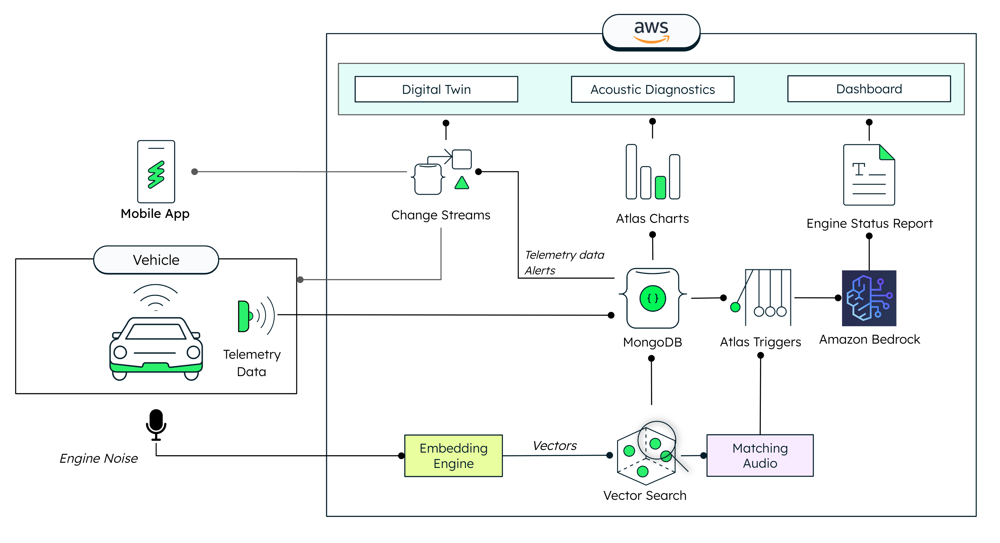

# Acoustic Based Real Time Diagnosis for machines using Vector Search

      

In this repo we will show how MongoDB Atlas can be used for a fully comprehensive connected equipment loop, from using Vector Search to diagnose the status of a machine based on its real-time sound, to connecting to AWS Bedrock to receive human readable reports that can be used by operators to fix the machine. And finally use MongoDB to store operational equipment data to create alerts or a dashboard and understand how the production process is going.

In the curren era of connected equipments, companies can use all the potential of MongoDB's tools (not just data storage) to increase productivity, reduce downtime, TCO and MTTR, across others. MongoDB can integrate fully with your current SCADA, MES or ERP systems through our Drivers, Change Streams, MQTT partners and much more.

In this demo we want to show the comprehensive nature of MongoDB and how all its tools can be used in a really powerful combination. To take it to reality, we are utilizing real hardware combined with Software. If you want to replicate this demo, you have two options:

- A) Copy our setup as close as possible. We will share below all the hardware components we have.

- B) We will have a 'lite' version of this demo where through a simulator, you will be able to replicate it without the need of the hardware.

In a very high level, this demo is composed of 3 main components:

- **The Hardware:** A 4-cylinder Engine scaled replica. Teching DM13
- **The Cloud:** MongoDB Atlas and its products.
- **The Connection between Hardware and Cloud:** A Raspberry Pi 5.

Now let's get into details to explain all the parts the demo has, how they are connected and how to replicate it.



## Prerequisites

- **npm** (version 9.6 or higher): The project relies on npm (Node Package Manager) to manage dependencies and run scripts. You need to have npm installed on your machine. You can download Node.js from the official website: [Node.js Downloads](https://nodejs.org/en/download). After installing Node.js, npm will be available by default.

- **mongorestore** (version 100.9.4 or higher): The [mongorestore](https://www.mongodb.com/docs/database-tools/mongorestore/) tool loads data from a binary database dump. The [dump](dump) directory includes a demo database with preloaded collections, views and indexes, to get you up and running in no time. This tool is part of the [MongoDB Database Tools](https://www.mongodb.com/docs/database-tools/) package, follow the [Database Tools Installation Guide](https://www.mongodb.com/docs/database-tools/installation/installation/) to install `mongorestore`. When you are done with the installation, run `mongorestore --version` in your terminal to verify the tool is ready to use.

- **Python** (version 3.9 or higher): This project requires Python to create the audio embeddings and perform the Vector Search operations. You can download Python from the official website: [Python Downloads](https://www.python.org/downloads/). After installing Python, verify the installation by running `python --version` in your terminal.

- **MongoDB Atlas Cluster** (M0 or higher): This project uses a MongoDB Atlas cluster to manage the database. You should have a MongoDB Atlas account and a minimum free tier cluster set up. If you don't have an account, you can sign up for free at [MongoDB Atlas](https://www.mongodb.com/cloud/atlas/register). Once you have an account, follow these steps to set up a minimum free tier cluster or follow the [Getting Started](https://www.mongodb.com/docs/atlas/getting-started/) guide:
  - Log in to your MongoDB Atlas account.
  - Create a new project or use an existing one, and then click “create a new database”.
  - Choose the free tier option (M0).
  - You can choose the cloud provider of your choice but we recommend using the same provider and region both for the cluster and the app hosting in order to improve performance.
  - Configure the cluster settings according to your preferences and then click “finish and close” on the bottom right.
  - Finally, add your IP to the network access list so you can access your cluster remotely.

## Step 1 - Get your hardware ready (Optional)

Whether you have access to hardware that emits noise or prefer to simulate it, this demo has you covered! You can run it with any noise-emitting hardware or use our Web UI for simulation if hardware isn't available.

For details on the specific setup we used, check out the [engine-controller folder](engine-controller/README.md).

## Step 2 - Set up MongoDB Atlas

In order to make the demo work end-to-end, you will need to replicate the demo database on your MongoDB Atlas cluster. Run the command below in your terminal, making sure to replace `<your-connection-string>` with your MongoDB Atlas connection string.

```bash
mongorestore --uri <your-connection-string> utils/dump/
```

After executing these commands, you will have the following collections:

- **vehicle:** A complete representation of the vehicle. Added for reference, but this demo will use the simplified representation available in `vehicle_data`.
- **vehicle_data:** A simplified representation of the logical vehicle state. We'll use this collection to keep track of the engine and battery status, as well as whether the vehicle is on or off.
- **dictionary:** This collection holds the different states that we'd like to classify using acoustic diagnostics. By default, it includes four states: "Engine Off," "Running Normally," "Soft Material Hit," and "Metallic Hit."
- **sounds:** It stores the embeddings of the sound samples for each of the states defined in `dictionary`.
- **results:** It will contain the results of the acoustic diagnostics. While we are streaming audio, each audio sample will be classified into its corresponding state.
- **reports:** When an issue has been identified, we will send the data to AWS Bedrock to enrich the analysis and get a human-readable report that will be stored in this collection.

> [!Note]
> You will need the database name to set up your environment variables later (`DATABASE_NAME`).
> If the database name has not been specified, the default name will be `automotive_acoustic_diagnostics`.

## Step 3 - Enable real-time acoustic diagnostics using Atlas Vector Search

Demonstration of MongoDB's Vector Search capabilities for anomaly detection through sound input. This demo enables real-time diagnosis by analyzing the emitted audio, allowing us to diagnose its condition—whether it's operating normally, stopped, or experiencing any issues. This analysis has been implemented in a Python module. We use [FastAPI](https://fastapi.tiangolo.com/) to serve the functionality to the web app via REST API, [PANNs inference](https://github.com/qiuqiangkong/audioset_tagging_cnn) to create the embedding of the audio samples, [MongoDB Atlas](https://www.mongodb.com/lp/platform/atlas) to store the resulting embeddings, and [Atlas Vector Search](https://www.mongodb.com/products/platform/atlas-vector-search) to classify new audio samples.

For a step-by-step guide on how to set up this component, navigate to the [acoustic-diagnostics-api folder](acoustic-diagnostics-api/README.md).

## Step 4 - Integrate AWS Bedrock for AI-enhanced analytics

We have followed a simple approach to integrate with AWS Bedrock, which can serve as a baseline for more complex approaches, implementing more real-time data from sensors and even implementing a RAG architecture.

We are going to use Atlas Triggers to integrate with AWS Bedrock.

1. Navigate to the Triggers section in MongoDB Atlas.
2. Create a new trigger that watches for update operations in the `vehicle_data` collection.
3. Turn the "Full Document" toggle on to have access to all the document fields in the change event.
4. In the advanced section, copy the match expression below. This will allow us to generate reports only for certain states of interest.
   ```json
   {
     "operationType": "update",
     "updateDescription.updatedFields.Engine_Status": {
       "$exists": true
     },
     "$or": [
       {
         "fullDocument.Engine_Status": "Soft Material Hit"
       },
       {
         "fullDocument.Engine_Status": "Metallic Hit"
       }
     ]
   }
   ```
5. Leave all the other fields as default, give your trigger a name, and copy the function available at [utils/triggers/generate_bedrock_report.js](utils/triggers/generate_bedrock_report.js). Remember to add the required dependencies (`"@aws-sdk/client-bedrock-runtime"`, `"text-decoding"`), and replace the placeholder in line 8 with your own cluster name.

## Step 5 - Run the web portal UI

The web portal, built with [Next.js](https://nextjs.org/), includes the vehicle's digital twin, an acoustic diagnostics interface for audio streaming and training, and the analytics dashboard.

To set it up navigate to the [web-app folder](web-app/README.md) and follow the instructions in the README file.

## Step 6 - Control your vehicle from a mobile device (Optional)

For a more realistic connected vehicle experience, you can control the engine replica and digital twin from a mobile app.

Navigate to the [ios-app folder](ios-app/README.md) to learn how to do the required setup.
