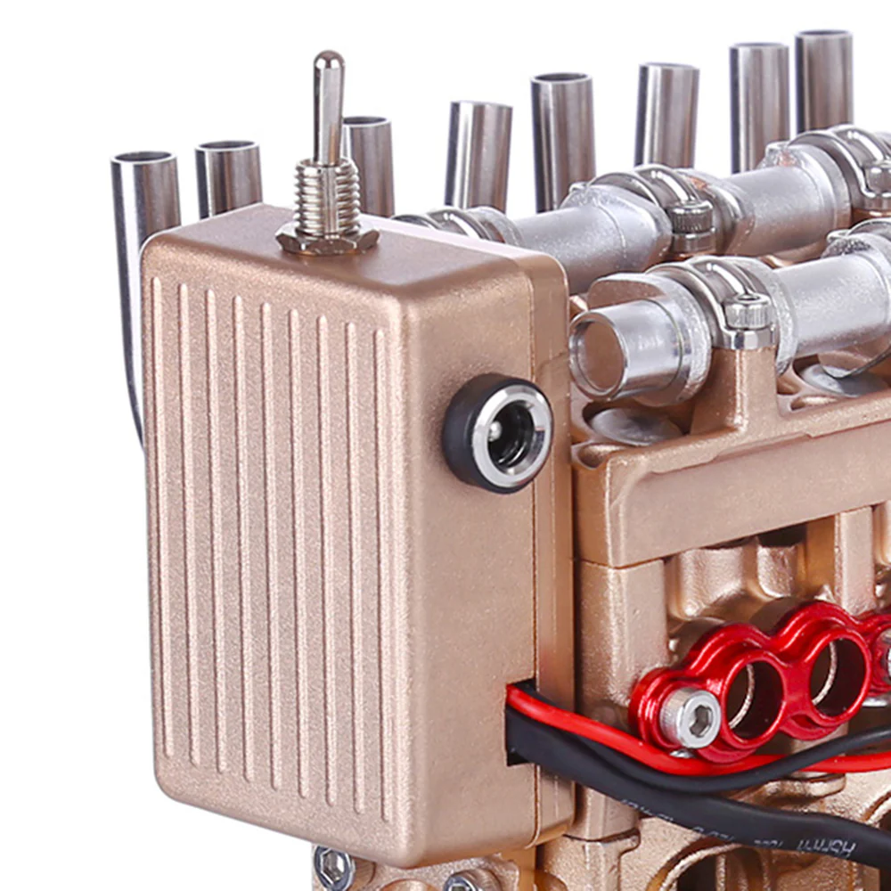
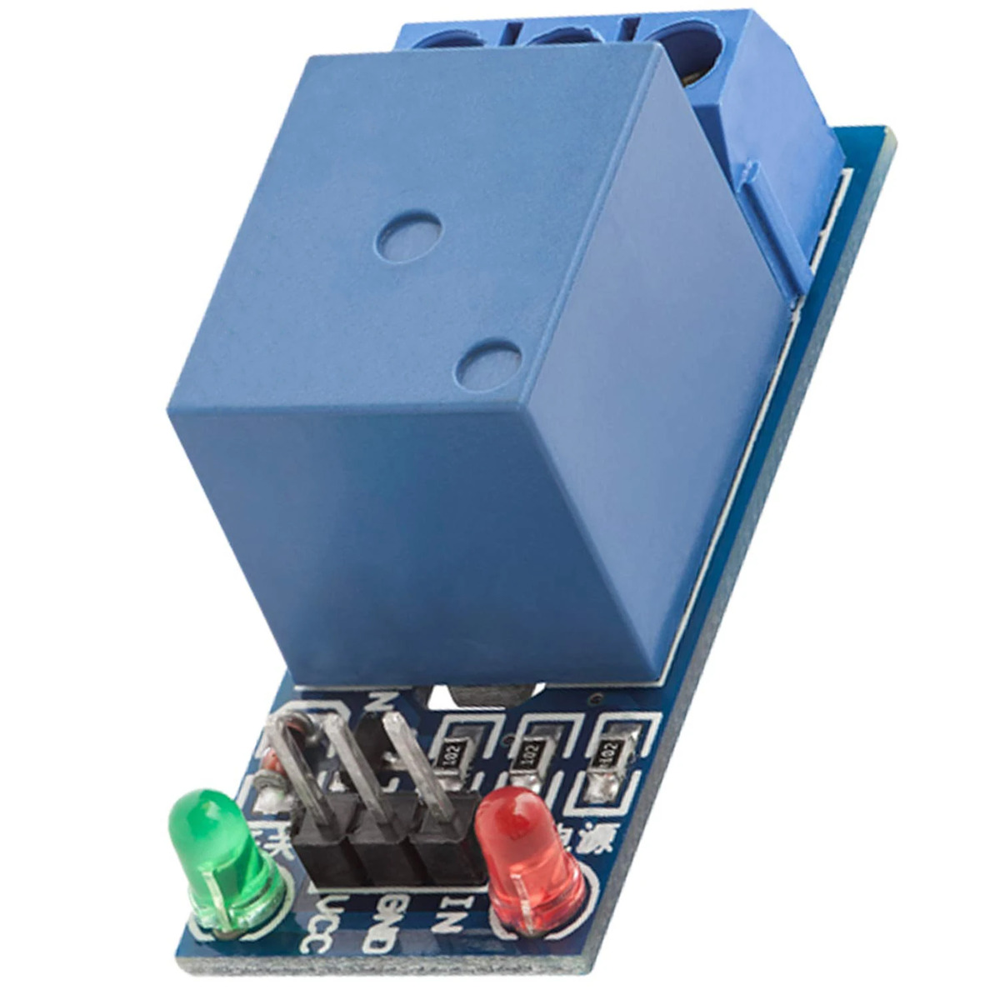
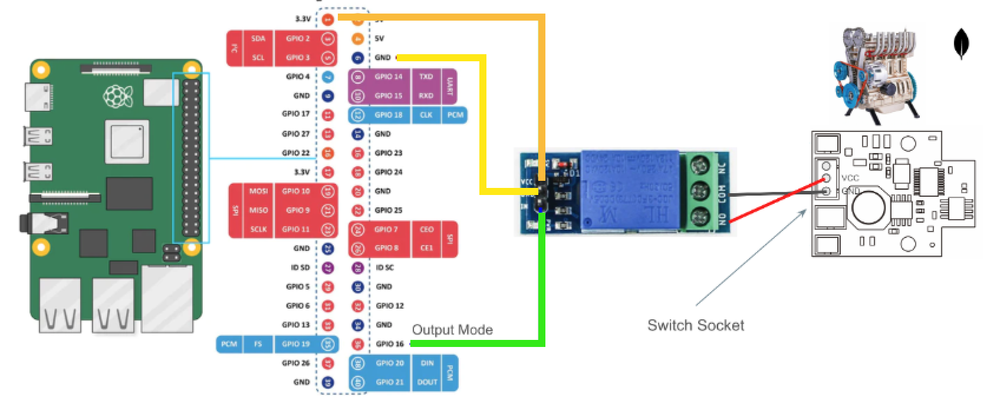
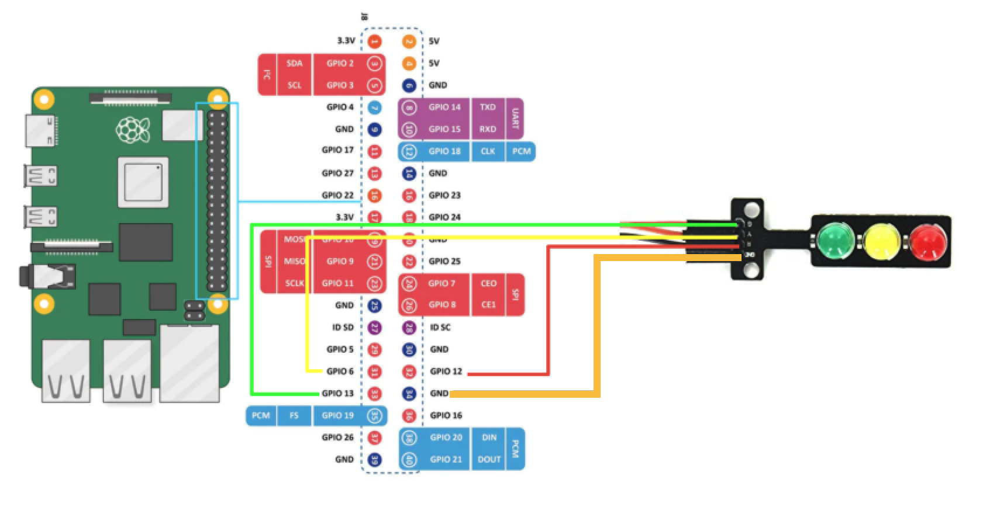
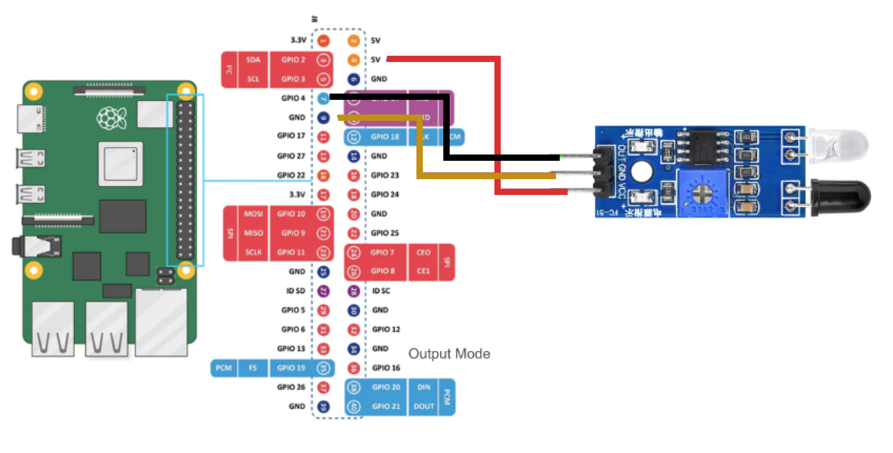

# Engine Controller

To replicate the real use case of a machine, we are using the 4-cylinder Engine replica Teching DM13. We decided to use this specific hardware because it's all made of metal, which makes it more sturdy for traveling and testing, and also because it was the right combination of cost, size and functionality between all the hardware we evaluated. But in reality this demo can be run with any piece of hardware (even a real machine!) that can run and make some noise.


The product requires the user to assemble the parts, and the parts move thanks to an electric motor connected to a set cog wheels, and chains that make its parts move. The electric motor is powered by a 500mAh Lithium Battery that can be charged.

This is an standalone product, that has a ON/OFF manual switch to power it. In order for us to be able to control the engine through MongoDB Atlas, we had to intervene.



That meant to connect the ON/OFF manual switch to a Relay (which is simply an electronically operated switch), so we don't have to turn the switch to our hands. Then, we connected the Relay to a Raspberry Pi 5 which will be the bridge to host the software that communicates with the Cloud.

## Hardware Specifications

We are going to use a **Raspberry Pi 5** 8GB for this demo. Here's the detailed information about our specific model:

    OS: Ubuntu 23.10 aarch64
    Host: Raspberry Pi 5 Model B Rev 1.0
    Kernel: 6.5.0-1009-raspi Shell: bash 5.2.15
    DE: GNOME 45.2
    WM: Mutter
    WM Theme: Adwaita
    Theme: Yaru [GTK2/3]
    cons: Yaru [GTK2/3]
    Terminal: gnome-terminal
    CPU: BCM2835 (4) @ 2.400GHz
    Memory: 1927MiB / 7943MiB

Additionally, there are a few extra items we got:

- 27W Power Delivery (The 15W power adapter won’t be enough to power the all the items)
- MicroSD of 256GBs, this is to store the OS.
- Cable HDMI-mHDMI 2.0

For this demo we used the 5V relay KF-301:



## Set up your hardware

This is how we electrically connected the Raspberry Pi (left of the image) to the Relay, and the Relay to the ON/OFF switch sockets of the engine (right of the image)



### Traffic ligth sensor cable schematic



### Proximity sensor cable schematic



> [!TIP]
> The python controller used on this demo refer directly to specific pins, so make sure you either follow the above schematic exactly, or you edit the code so the program uses the necessary pins of the Raspberry Pi.

By the end, the RPi should have 3 things connected to its pins:

- Relay to control the engine
- Traffic Light Sensor
- Infrared Proximity Sensor

And this is it! congratulations on setting up the physical connection of the hardware, now let's go an run the programs on the Raspberry Pi 5!

## Run the engine controller

First, you will need to install some dependencies from the Raspberry Pi terminal to be able to run the Python program.

```
apt install python3-dotenv
apt install python3-pymongo
apt install python3-gpiozero
```

> [!WARNING]
> The library `gpiozero` has issues to run in a venv python environment. We suggest installing the libraries globally.

Then, navigate to the `engine-controller` folder, create a `.env` file and update the neccesary environemnt variable. You can use the `EXAMPLE.env` file as a reference. From the Rasperry Pi terminal, run the command below to create the .env file prepopulated with the default values:

```
cp EXAMPLE.env .env
```

Once this is done you will be ready to run the command below to start the controller.

```
python3 main.py
```

## Basic Troubleshooting

- If you see weird behaviors with the Sensors (Relay Clipping, LEDs not turning On, InfraRed Sensor not working, engine turning on and off constantly)
  - Disconnect the engine (always first)
  - Make sure there are no obstacles obstructing the IR (Infrared) sensor
  - Double check the cable connections
- If you see some errors on the Terminals
  - Disconnect the engine (always first)
  - Stop the Terminals
  - Go to Atlas and make sure everything is working fine in Atlas.
  - Re-start the programs

---

And that's it! Your engine should now be up and running smoothly. If everything is working as expected, you're ready to move on to the next step. Head over to the main README and check out [Step 2 - Set up MongoDB Atlas](../README.md#step-2---set-up-mongodb-atlas) to continue with the setup!
